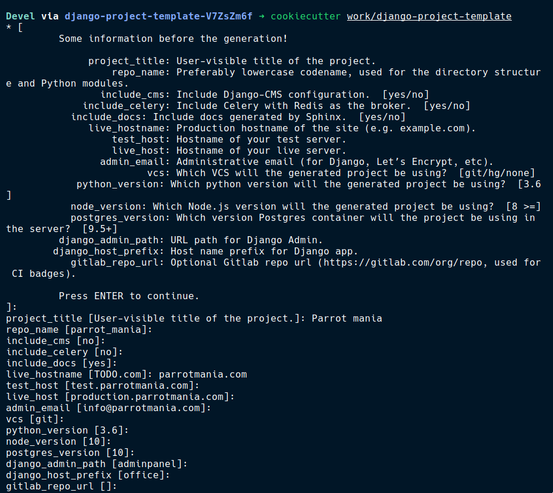
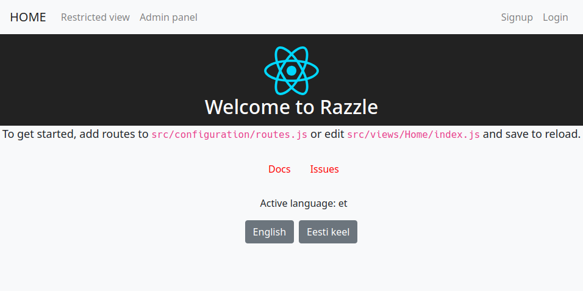
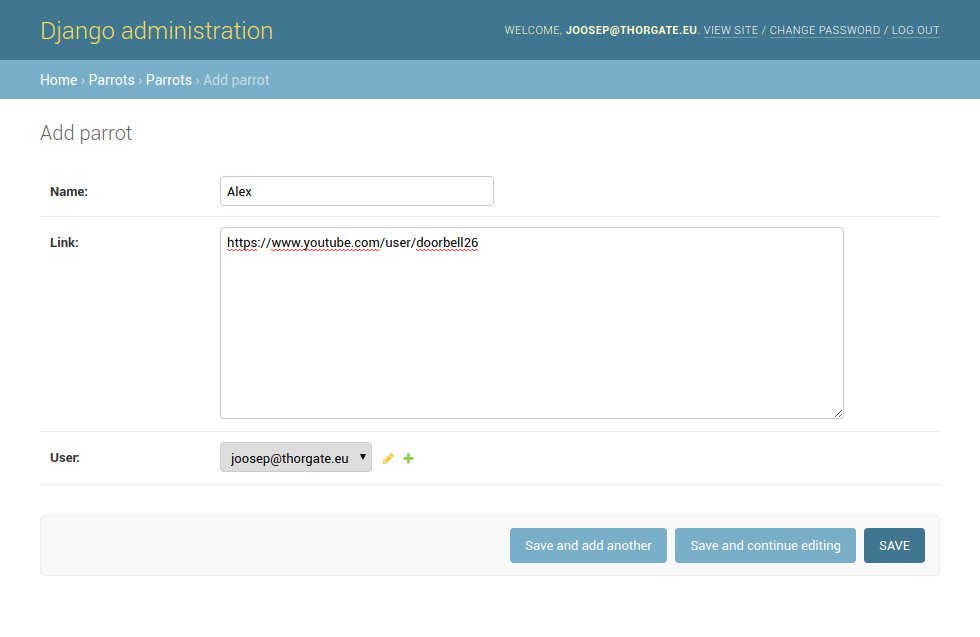
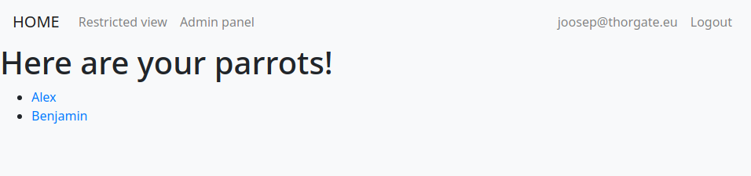
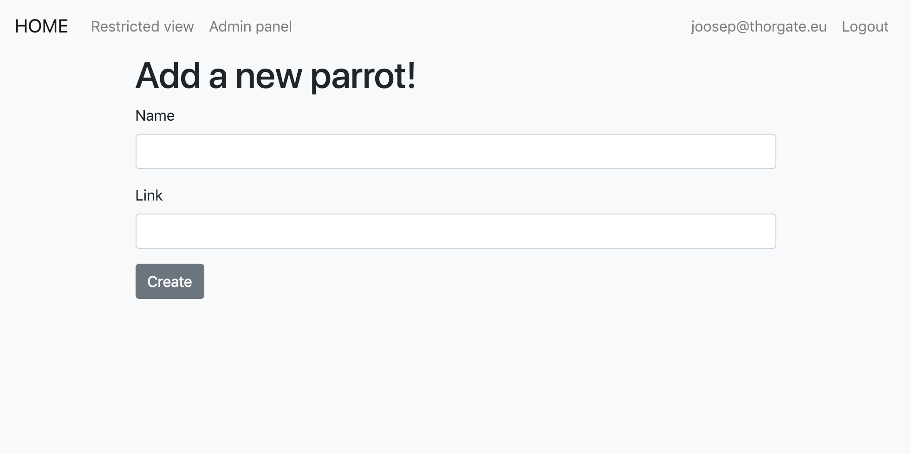

# Getting started with Thorgate's SPA project template (???)

(using Django, React, Redux, Redux Saga, Razzle, Docker)

Intro here - we at Thorgate have recently released a new version of our SPA
template with Django, React, Redux and Redux Saga. In this post, we're going to
be building a simple application that can be used to keep track of notable
parrots.

**TODO: Why SPA & trends n stuff**

* More and more complexity is taken to the client side
* Total separation of client and server apps

TODO: I assume that you know a little bit about Django and a little bit of
React. But since we're going through pretty simple examples, you can follow
along.

Even if you don't start using our template, it's a good source of inspiration
for your own project set up.

The template is available on [GitLab][template-repo] on the `spa` branch. The
repository also includes a more standard Django application template on the
`master` branch.

## Quick overview (??)

The template is a [`cookiecutter`][cookiecutter] template, meaning that it can
easily be used to generate your own project. Here are some of the main
technologies included and set up in the template:

* [Django][django] - we are an agency focusing on Python and Django
* [React][react] - our front-end library of choice
* [Redux][redux] - state management for intricate React applications
* [Razzle][razzle] - enabling server-side rendering
* [PostgreSQL][postgres] - our database management system of choice
* [SCSS][scss] - a nicer way to write CSS
* [Docker][docker] - everything can be run in containers
* [Docker Compose][docker-compose] - orchestrating the Docker containers
* [Fabric][fabric] - automatic deploys

All of these are included in the template and configured to work well. There is
more information in the [readme][template-repo] of the template.

[django]: https://www.djangoproject.com
[readme]: https://gitlab.com
[react]: https://reactjs.org/
[redux]: https://redux.js.org/
[razzle]: https://github.com/jaredpalmer/razzle
[docker]: https://www.docker.com/
[docker-compose]: https://docs.docker.com/compose/
[cookiecutter]: https://github.com/audreyr/cookiecutter
[fabric]: http://www.fabfile.org/
[scss]: https://sass-lang.com/
[postgres]: https://www.postgresql.org/

## Getting up and running

### Requirements

There are a couple of pre-requisites for generating the project and running it.
We use Pipenv for managing Python dependencies and generating projects. If you
haven't used Pipenv before, then it is a really nice package manager for Python.

Firstly, make sure that you have `pipenv` available, it can easily be installed
following the [installation instructions][pipenv-install] on their website. In
order to run the project, we also need Docker and `docker-compose`. Follow
instructions on how to install those in [Docker's
documentation](https://docs.docker.com/engine/installation/) and [Docker
Compose's documentation](https://docs.docker.com/compose/install/).

For reference, here are the versions of the packages I'm using:

    $ pipenv --version
    pipenv, version 2018.11.26

    $ docker --version
    Docker version 18.09.0-ce, build 4d60db472b

    $ docker-compose --version
    docker-compose version 1.23.2, build unknown

[pipenv-install]: https://pipenv.readthedocs.io/en/latest/install/#installing-pipenv

### Generating the project

Now that everything is set up, you can generate your project! Clone the project
template anywhere on your file system and make sure to clone the `spa` branch:

    git clone https://gitlab.com/thorgate-public/django-project-template.git -b spa
    cd django-project-template

    # or

    git clone https://gitlab.com/thorgate-public/django-project-template.git
    cd django-project-template
    git checkout spa

Next, install the dependencies needed to build a new project. This includes
`cookiecutter` and a few other packages specified in the template's `Pipfile`.

    pipenv install

This installs the packages into a `django-project-template-XXXXXXXX` virtualenv
that you don't even have to think about -- Pipenv manages all your
dependencies. Finally, we can generate a new project!

Let's activate the virtual environment Pipenv has created for us and navigate
to any folder you want the project to be in:

    # Still in the django-project-template directory
    pipenv shell
    cd ~/devel/awesome-projects

Now all that's left is to run `cookiecutter` to generate the project and answer
some questions about it:

    cookiecutter path/to/django-project-template



I named my project Parrot-mania as it can be used to save notable parrots.

Now that the project has been generated, we can deactivate the
`django-project-template` Pipenv environment since it only contains
`cookiecutter` and a few other packages. You can do this by just running
`exit`.

### Running the generated project

A `Makefile` is included in the new project with helpers for running common
commands. You don't need to know anything about `make` or `c`, they're just
`bash` commands. The `Makefile` also includes a set up script that should be
the first thing to run when setting up a new project:

    make setup

You can find additional useful `make` scripts in the readme, or by checking out
the `Makefile`.

This will create a new Pipenv environment for you, install packages, build the
necessary Docker images, and run initial migrations. In addition, it will ask
you to edit your local Django settings file, just save and close that. If the
settings file opens in `vi`, then you can save and exit by typing
`<Esc>:wq<Enter>`.

Now that the project is set up, we can run it through Docker and open
`127.0.0.1:8000` in the browser:

    docker-compose up
    # or
    make docker



Just like that we have set up a new project with a Django API, a React
front-end app with Redux and Redux Saga, server-side rendering using Razzle,
and a PostgreSQL database. Since all of these services are running in Docker
containers, we didn't need to install much locally.

## Overview of the structure

TODO: The structure section probably needs more work. Not sure what to add here.

Let's quickly go through the most important files and directories in our new
project. First, the top level files and directories look like this:

```
.
├── app/  - front-end web app
├── parrot_mania/  - back-end Django API
├── docker-compose.production.yml
├── docker-compose.yml
├── Dockerfile-django
├── Dockerfile-django.production
├── Dockerfile-node
├── Dockerfile-node.production
├── Makefile
└── Pipfile
```

`docker-compose` and `Dockerfile` files are used to configure Docker, check
them out if you'd like to know more. `Makefile` includes useful utilities like
`make setup`, `make makemigrations`, and `make quality`. A more in-depth list
can be found in the `README.md` and, of course, you can just go through the
`Makefile` if you'd like a detailed overview of what's there.

The `app` directory includes these important files/directories:

```
.
├── package.json
├── razzle.config.js  - Razzle's configuration file
├── SPA.md  - more information about the client app's structure
├── public/
└── src
    ├── components/  - standard React components
    ├── configuration/ - Redux & routes config
    ├── decorators/  - useful higher order components, e.g., loginRequired
    ├── ducks/  - Redux ducks
    ├── forms/  - Formik forms
    ├── sagas/  - Redux Saga sagas
    ├── settings/
    ├── styles
    │   ├── config/  - global variables & Bootstrap config
    │   └── main.scss  - all SCSS files are imported here
    ├── utils/  - useful utilities like translations and PropTypes
    └── views/  - pages
```

Since the project is based on [Razzle][razzle], we include `razzle.config.js`
so that it can easily be configured.

We generally use `ducks` as a way to bundle together Redux actions, reducers,
and action types. You can read more about `ducks` here: [Ducks: Redux Reducer
Bundles][ducks].

[Formik][formik] is a nice package for building forms in React without the
tears. These forms are located in `src/forms`. We'll go through a simple example
form together as well.

The backend structure is quite similar to a default Django app.

```
.
├── accounts/
├── manage.py
├── parrot_mania/
└── settings
    ├── base.py
    ├── local.py
    ├── local.py.example
    ├── local_test.py
    ├── local_test.py.example
    ├── production.py
    ├── staging.py
    └── test.py
```

The main difference from a default installation are that JWT authentication is
already set up, and that Django settings are divided into environment-based
configuration files. This means that one can easily use different settings for
production, development, and testing.

Another important thing to mention here is that we use a collection of packages
that include a bunch of useful SPA utilities. These packages have the
`@thorgate` prefix in the client's dependencies. The documentation and source
code for those packages is available on the [`tg-spa-utils` GitHub
page][tg-spa-utils].

We also have quite a few other packages that make developing with Django and
React easier.

Don't worry if this seems a bit overwhelming right now, we'll go through some
simple examples together.

[razzle]: https://github.com/jaredpalmer/razzle
[ducks]: https://github.com/erikras/ducks-modular-redux
[formik]: https://github.com/jaredpalmer/formik
[tg-spa-utils]: https://github.com/thorgate/tg-spa-utils

## Our example app

Now that you have a general overview of what the project structure is like, we
can start building our small application!

I would like to create a simple Parrot reference web app that can be used to
keep track of interesting parrots. Each user can add parrots and see a list
of their parrots. We'll make sure that server-side rendering works and make use
of some of the interesting technologies included in the project template.

### Showing parrots

Let's start with showing the user their saved parrots. Since we already have
users and authentication set up, then we don't need to put too much effort into
getting the current user's personal parrots.

Firstly, it's a good idea to create a superuser account for development. We
would normally call `python manage.py createsuperuser` to create a superuser in
Django, but since we're running everything inside Docker, then it would be a
bit trickier. Something like this would do the trick: `docker-compose run --rm django python manage.py createsuperuser`. But who can remember that? In order to
make it easier for everyone, the `Makefile` includes a useful alias for running
management commands: `make docker-manage cmd="createsuperuser"`. Now we can
either click on "Admin panel" in the navbar or go to
`http://127.0.0.1:8000/adminpanel/` to see the Django admin page.

Let's create a new app `parrots`!

    make docker-manage cmd="startapp parrots"

Since the folder is created inside the Docker container, it is possible that
its permissions are incorrect. We can fix that by running the following command:

    sudo chown -R "$(id -un):$(id -gn)" parrot_mania

We will also need to add our newly generated app to our `INSTALLED_APPS` in
`settings/base.py`:

```
INSTALLED_APPS = [
    # Local apps
    'accounts',
    'parrot_mania',
    'parrots',
    ...
]
```

Now we can add our `Parrot` model in `parrots/models.py`:

```
from django.db import models

from accounts.models import User


class Parrot(models.Model):
    name = models.CharField(max_length=255)
    link = models.TextField()
    user = models.ForeignKey(User)
```

And let's register the `Parrot` model to our admin site in `parrots/admin.py`
as well:

```
from django.contrib import admin

from parrots.models import Parrot


admin.site.register(Parrot)
```

And let's migrate our database using aliases from the `Makefile`:

    make makemigrations
    make migrate

Now we can add parrots through the Django admin!



The next step is to create a page on the front-end where we will show the
parrots. At first, let's use some dummy data so that we can focus on just
React. Create a file at `app/src/views/ParrotsList.js`:

```
import React from 'react';
import { Container } from 'reactstrap';

import withView from 'decorators/withView';

const exampleParrots = [
    { id: 1, name: 'Alex', link: 'https://www.youtube.com/user/doorbell26' },
    { id: 2, name: 'Benjamin', link: 'https://www.youtube.com/user/parrotpost' },
];

const ParrotsList = () => (
    <Container>
        <h1>Here are your parrots!</h1>
        <ul>
            {exampleParrots.map((parrot) => (
                <li key={parrot.id}>
                    <a href={parrot.link}>{parrot.name}</a>
                </li>
            ))}
        </ul>
    </Container>
);

export default withView()(ParrotsList);
```

But how do we say that this is an actual page that React will render on a
specific URL? Well, we need to specify this in the `src/configuration.routes.js`
file.

Add the following object towards the end of the existing routes, just above the
last `NotFoundRoute`:

```
...
{
    path: '/parrots',
    exact: true,
    name: 'parrots-list',
    component: ParrotsList,
},
NotFoundRoute,
```

We also need to import the component though, so let's add this to the top of
the file:

```
const ParrotsList = loadable(() => import('views/ParrotsList'));
```

This funny import handles code-splitting and dynamically loading only necessary
JavaScript for the page that the user is currently on.

Now we can navigate to `http://127.0.0.1:8000/parrots` and see our example
parrots!



This is a good time to make sure that our server-side rendering works, we can
`curl` the `/parrots` page:

```
curl http://127.0.0.1:8000/parrots

...
<h1>Here are your parrots!</h1>
...
```

Even though the HTML is minified, we can see that includes our example parrots
and their links.

So far it has been a pretty standard Django and React application, but now that
we need to show dynamic data to the user, we need communication between the
server and the client. Let's first do this by just standard HTTP requests and
then bring in Redux Saga later.

Firstly, we need an API endpoint to fetch parrots. Using Django Rest Framework,
it is possible to set up API endpoints very quickly. Let's create our DRF
serializer in `parrot_mania/parrots/serializers.py`:

```
from rest_framework import serializers

from parrots.models import Parrot


class ParrotSerializer(serializers.ModelSerializer):
    class Meta:
        model = Parrot
        fields = ('id', 'name', 'link')
```

And our viewset in `parrot_mania/parrots/views.py`:

```
from rest_framework import viewsets
from rest_framework.permissions import IsAuthenticated

from parrots.models import Parrot
from parrots.serializers import ParrotSerializer


class ParrotViewSet(viewsets.ModelViewSet):
    queryset = Parrot.objects.all()
    serializer_class = ParrotSerializer
    permission_classes = [IsAuthenticated]

    def get_queryset(self):
        return super().get_queryset().filter(user=self.request.user)
```

And register the viewset's URLs using Django Rest Framework's router in
`parrot_mania/parrots/urls.py`:

```
from rest_framework import routers

from parrots.views import ParrotViewSet


router = routers.SimpleRouter()
router.register(r'parrots', ParrotViewSet, base_name='parrots')
urlpatterns = router.urls
```

And finally include these URLs in `parrot_mania/parrot_mania/rest/urls.py`

```
urlpatterns = [
    ...
    url(r'^', include('parrots.urls')),
]
```

We can test it out with `curl` if we remove the authentication check and
current user filtering:

```
class ParrotViewSet(viewsets.ModelViewSet):
    queryset = Parrot.objects.all()
    serializer_class = ParrotSerializer
    # permission_classes = [IsAuthenticated]

    # def get_queryset(self):
    #     return super().get_queryset().filter(user=self.request.user)
```

```
curl http://127.0.0.1:8000/api/parrots/

[
    {"id":1,"name":"Alex","link":"https://www.youtube.com/user/doorbell26"},
    {"id":2,"name":"Benjamin","link":"https://www.youtube.com/user/parrotpost"}
]
```

We need to get this data to our front-end though. At first, let's try to do
this with a simple `fetch` request:

```
import React, { Component } from 'react';
import { Container } from 'reactstrap';

import withView from 'decorators/withView';

class ParrotsList extends Component {
    state = {
        parrots: [],
    };

    componentDidMount() {
        fetch('/api/parrots')
            .then((res) => res.json())
            .then((parrots) => {
                this.setState({ parrots });
            });
    }

    render() {
        return (
            <Container>
                <h1>Here are your parrots!</h1>
                <ul>
                    {this.state.parrots.map((parrot) => (
                        <li key={parrot.id}>
                            <a href={parrot.link}>{parrot.name}</a>
                        </li>
                    ))}
                </ul>
            </div>
        );
    }
}

export default withView()(ParrotsList);
```

The problem here though, is that the parrots do not get server-rendered anymore
since they are fetched in `componentDidMount` -- when the component has been
rendered on the client side. In order to fix this, you can write your first
Saga. A saga listens to any dispatched Redux actions and can react to them --
for example, dispatching more actions or making API requests. In our SPA
projects, all communication with the API goes through Sagas.

The saga we will write will be very simple. It's going to be called whenever
anyone navigates to the `/parrots` route. In addition, it will be called on the
server whenever the user _initially_ navigates to the `/parrots` route.

At first, let's just log something to the console so that we see that it's
working. Create a `app/src/sagas/parrots` directory and a `fetchUserParrots.js`
file inside it with the following contents (make sure not to miss the `*` next
to `function`).

```
export default function* fetchUserParrots() {
    console.log('Fetching some parrots!');
}
```

We also need to configure this saga to be triggered whenever users visit the
`/parrots` page. In order to do that, we can import the saga and modify our
route configuration in `configuration/routes.js`:

```
import fetchUserParrots from 'sagas/parrots/fetchUserParrots';

...

{
    path: '/parrots',
    exact: true,
    name: 'parrots-list',
    component: ParrotsList,
    initial: [
        fetchUserParrots,
    ],
},
```

Now we should see the logged message in the console.

Sagas offer a way of handling side effects in Redux projects (like API requests)
which are easy to manage and test. Redux Saga has a nice introduction on their
site at https://redux-saga.js.org.

In our project template, the sagas specified in the `initial` array for each
route are executed whenever a user visits the route. They're also executed on
the server-side so that data can be fetched on the server and returned to the
user when they first query the page.

**TODO**: This is probably a good time to explain SSR? With some nice graphics

Now that we have a function that's triggered when the user queries `/parrots`,
we can add API request logic there. But before that, let's create a Redux duck
for containing the parrots. Create the `app/src/ducks/parrots.js` file and add
the following:

```
import { combineReducers } from 'redux';

export const RECEIVE_PARROTS = 'parrots/RECEIVE_PARROTS';

const parrotsReducer = (state = [], action) => {
    switch (action.type) {
        case RECEIVE_PARROTS:
            return action.parrots;

        default:
            return state;
    }
};

export default combineReducers({
    parrots: parrotsReducer,
});


// Action creators

export const receiveParrots = (parrots) => ({
    type: RECEIVE_PARROTS,
    parrots,
});
```

We also need to configure our application to use the `parrots` duck. We can do
that in `configuration/reducers.js`:

```
import parrots from 'ducks/parrots';

export default (history) => combineReducers({
    ...
    parrots,
});
```

Finally, we can connect the `ParrotsList` component to the Redux store:

```
import React from 'react';
import { Container } from 'reactstrap';
import { connect } from 'react-redux';

import withView from 'decorators/withView';

const ParrotsList = ({ parrots }) => (
    <Container>
        <h1>Here are your parrots!</h1>
        <ul>
            {parrots.map((parrot) => (
                <li key={parrot.id}>
                    <a href={parrot.link}>{parrot.name}</a>
                </li>
            ))}
        </ul>
    </Container>
);

const mapStateToProps = (state) => ({
    parrots: state.parrots.parrots,
});

const ParrotsListConnector = connect(
    mapStateToProps,
)(ParrotsList);

export default withView()(ParrotsListConnector);
```

It is now possible to dispatch `RECEIVE_PARROTS` actions with some parrots and
see them. Let's quickly try this out without any API requests just to make sure
everything works alright. Edit the `fetchUserParrots` saga:

```
import { put } from 'redux-saga/effects';

import { receiveParrots } from 'ducks/parrots';

export default function* fetchUserParrots() {
    yield put(receiveParrots([
        { id: 1, name: 'Alex', link: 'https://www.youtube.com/user/doorbell26' },
        { id: 2, name: 'Benjamin', link: 'https://www.youtube.com/user/parrotpost' },
    ]));
}
```

And we should now be able to see the hard-coded parrots again! We dispatch the
`RECEIVE_PARROTS` action using `put`. The next thing to do is to make an API
request to retrieve the user's parrots and dispatch the action using those
parrots instead.

We could use `fetch` to make this API request, but we have a helper library for
making API requests called `tg-resources` (which uses `fetch` or `superagent`
under the hood). Using `tg-resources`, we can configure a "resource" that can be
used to easily make API calls. Let's configure the `parrotsList` resource in
`services/api.js`. In the `createSagaRouter` arguments, add the `parrots`
resource like so:

```
const api = createSagaRouter({
    ...
    parrots: {
        list: 'parrots/',
    },
}, {
    ...headers, apiRoot settings, etc.
});
```

We can now make use of this resource in the `fetchUserParrots` Saga:

```
import { put } from 'redux-saga/effects';

import { receiveParrots } from 'ducks/parrots';
import api from 'services/api';

export default function* fetchUserParrots() {
    try {
        const parrots = yield api.parrots.list.fetch();
        yield put(receiveParrots(parrots));
    } catch (err) {
        console.error('Something went wrong!');
    }
}
```

We call the `fetch` method on the `api.parrots.list` resource triggering a GET
request to `/api/parrots/`. Similarly, we could use `post` to make a POST
request with some data.

A simple way to check if server-side rendering works is to right click on the
page and selecting "View Page Source". The saved parrots should show up in the
original HTML the server sends to the browser.

**TODO: Explain generators and `yield`?**

### Creating parrots

Currently, the only way to add parrots is via the admin page. This is a bit of a
problem since then only admin users can add parrots. Also, it's quite
inconvenient to navigate to the "add a parrot" admin page. So, let's create a
new view with a form for creating parrots.

Let's add a simple non-functional form view to `views/CreateParrot.js`:

```
import React from 'react';
import { Form, FormGroup, Label, Input, Button, Container } from 'reactstrap';

const CreateParrot = () => (
    <Container>
        <h1>Add a new parrot!</h1>
        <Form>
            <FormGroup>
                <Label for="name">Name</Label>
                <Input name="name" id="name" />
            </FormGroup>
            <FormGroup>
                <Label for="link">Link</Label>
                <Input name="link" id="link" type="url" />
            </FormGroup>
            <Button>Create</Button>
        </Form>
    </Container>
);

export default CreateParrot;
```

And add a route for it in `configuration/routes.js`:

```
const CreateParrot = loadable(() => import('views/CreateParrot'));
...
{
    path: '/parrots/create',
    exact: true,
    name: 'create-parrots',
    component: CreateParrot,
},
```

You should see a page like this at `/parrots/create`:



Unfortunately, we don't currently have access to any field values that the user
inputs. One option would be to convert the component to a class component and
keep track of the name and the link in the component's state. Another option
would be to use refs and manually query the name and link inputs for their
values when the user submits the form.

Those solutions require a lot of manual work though (especially for larger
forms). So, let's use a package that makes forms in React a breeze: Formik. We
can convert our component to use Formik like so:

```
import React from 'react';
import { FormGroup, Label, Input, Button, Container } from 'reactstrap';
import { Formik, Form } from 'formik';

const CreateParrot = () => (
    <Container>
        <h1>Add a new parrot!</h1>
        <Formik
            initialValues={{ name: '', link: '' }}
            onSubmit={(values) => {
                console.log('Submitting!', values);
            }}
        >
            {({ values, handleChange }) => (
                <Form>
                    <FormGroup>
                        <Label for="name">Name</Label>
                        <Input
                            name="name"
                            id="name"
                            value={values.name}
                            onChange={handleChange}
                        />
                    </FormGroup>
                    <FormGroup>
                        <Label for="link">Link</Label>
                        <Input
                            name="link"
                            id="link"
                            type="url"
                            value={values.link}
                            onChange={handleChange}
                        />
                    </FormGroup>
                    <Button type="submit">Create</Button>
                </Form>
            )}
        </Formik>
    </Container>
);

export default CreateParrot;
```

Formik keeps track of the form's state internally and uses a render props based
API to allow us to access the state and modify it. It is very simple to add
validation, showing validation errors, and handling server errors. Even things
like disabling the submit button when the user has clicked it is very simple.

You should now see a message logged to the console with the values you inputted.

Now, we need to send this data to the server so that the server can store the
parrot in the database. A very simple way to do it would be to just send a fetch
request in the `onSubmit` handler, but let's use a Saga for that.

Let's add a `createParrot.js` file to `sagas/parrots/` with the following
contents:

```
import { takeEvery } from 'redux-saga/effects';


const CREATE_PARROT = 'CREATE_PARROT';

export const createParrot = (name, link) => ({
    type: CREATE_PARROT,
    name,
    link,
});

function* createParrotSaga(createParrotAction) {
    console.log('create parrot:', createParrotAction);
}

export default function* createParrotWatcher() {
    yield takeEvery(CREATE_PARROT, createParrotSaga);
}
```

This saga specifies its own action that it can react to -- `CREATE_PARROT`. The
`createParrotWatcher` will be watching for any dispatched `CREATE_PARROT`
actions and run `createParrotSaga` passing it the action as the argument.
Currently we're just logging the `createParrotAction` in order to make sure that
we get passed the correct data. Let's configure this Saga to "watch" for any
actions dispatched in the `/parrots/create` route by adding it as the `watcher`
for that route in `routes.js`:

```
{
    path: '/parrots/create',
    exact: true,
    name: 'create-parrots',
    component: CreateParrot,
    watcher: createParrotWatcher,
},
```

And finally, let's connect our `CreateParrot` component to Redux:

```
...
import { connect } from 'react-redux';

import { createParrot } from 'sagas/parrots/createParrot';

const CreateParrot = ({ createParrot }) => (
    <Container>
        <h1>Add a new parrot!</h1>
        <Formik
            initialValues={{ name: '', link: '' }}
            onSubmit={(values) => {
                createParrot(values.name, values.link);
            }}
        >
            ...
        </Formik>
    </Container>
);

const mapDispatchToProps = (dispatch) => ({
    createParrot: (name, link) => dispatch(createParrot(name, link)),
});

const CreateParrotConnector = connect(
    null,
    mapDispatchToProps,
)(CreateParrot);

export default CreateParrotConnector;
```

Now, whenever the form is submitted, we dispatch the `CREATE_PARROT` action
passing it the name and the link.

We should now see the logged message in the console with the
`createParrotAction` including the specified `name` and `link`.

We can now send a POST request to the server using our `parrots.list` resource:

```
...
import api from 'services/api';

...

function* createParrotSaga(createParrotAction) {
    try {
        const { name, link } = createParrotAction;
        yield api.parrots.list.post(null, { name, link });
    } catch (e) {
        console.log('Something went wrong!');
    }
}

...
```

This _almost_ works. We aren't currently sending the `user_id` field to the
server, but since it's required, we get a `500` error saying that the `user_id`
field cannot be `null`. It would be great if we didn't need to send this
`user_id` manually, but instead, Django would take the authenticated user and
save the parrot to the database with that user's ID.

We can accomplish this very easily by overriding the `perform_create` method on
the `ParrotViewSet` and passing the currently authenticated user to the
serializer:

```
class ParrotViewSet(viewsets.ModelViewSet):
    ...

    def perform_create(self, serializer):
        return serializer.save(user=self.request.user)
```

Creating parrots should now work! However, we don't actually see anything
happening. Let's redirect the user to `/parrots` once the request has finished.
In the `createParrot` Saga, modify the `createParrotSaga` function like so:

```
import { push } from 'connected-react-router';
import { takeEvery, put } from 'redux-saga/effects';
...

function* createParrotSaga(createParrotAction) {
    try {
        const { name, link } = createParrotAction;
        yield api.parrots.list.post(null, { name, link });

        yield put(push('/parrots'));
    } catch (e) {
        console.log('Something went wrong!');
    }
}

...
```

Let's also add a link to `/parrots/create` to our `ParrotsList` component:

```
...
import { Link } from 'react-router-dom';
...
const ParrotsList = ({ parrots }) => (
    <Container>
        <h1>Here are your parrots!</h1>
        <Link to="/parrots/create">
            Add a new parrot!
        </Link>
        ...
    </Container>
);
```

The functionality I planned for Parrot-mania is finished now! If you're eager to
continue working on this project, try adding updating and deleting of parrots as
well in order to make it a full CRUD app.

You can check out the full source of Parrot-mania here:
[https://github.com/JoosepAlviste/parrot-mania](https://github.com/JoosepAlviste/parrot-mania).

## Conclusion

We created a simple parrots' management web app using some interesting
technologies included in Thorgate's SPA project template.

Let me know if you'd like a follow-up post by leaving a comment or giving me a
clap or two!
