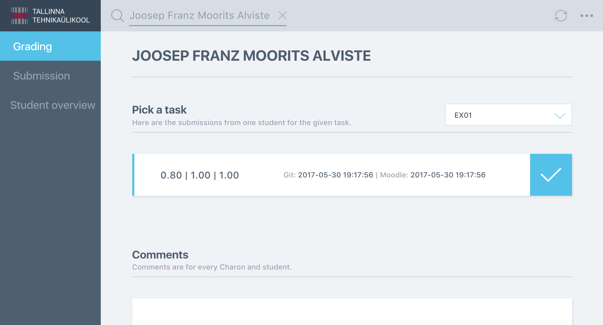
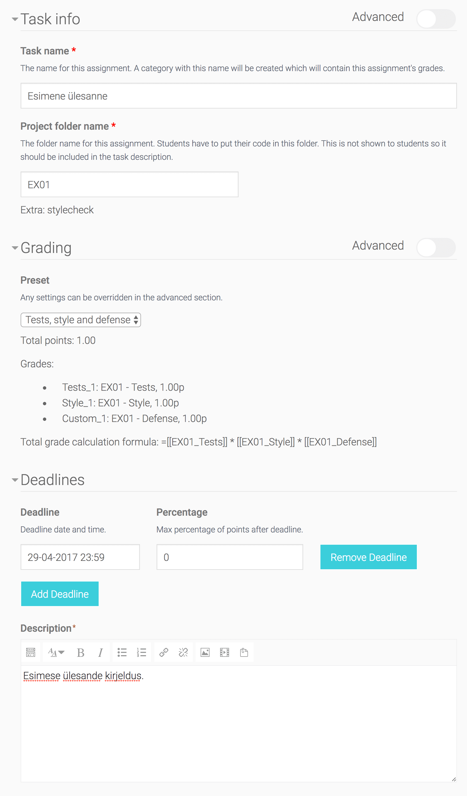
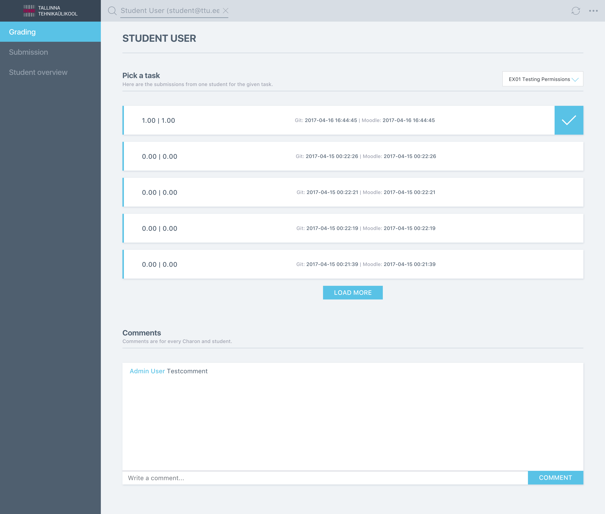
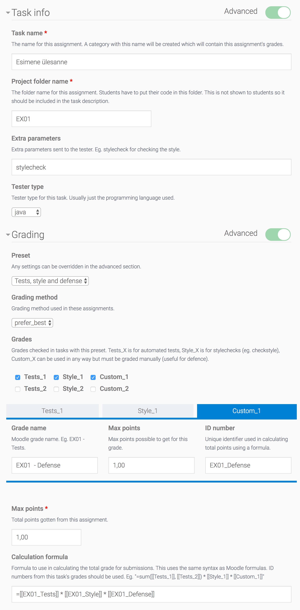
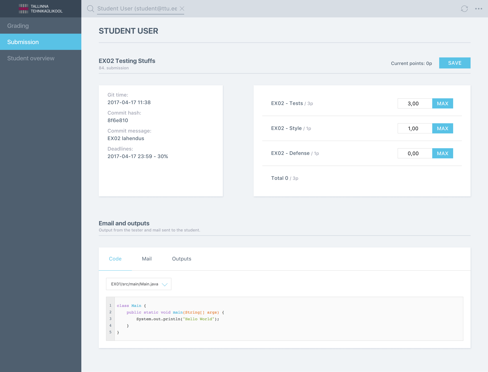

## TL;DR

* Back-end: PHP, [Laravel](https://laravel.com/)
* Front-end: JavaScript, [Vue.js](https://vuejs.org/), SCSS, SPA grading
  interface
* Continuous Integration: [Jenkins](https://jenkins.io/),
  [Docker](https://www.docker.com/)
* UML, Diagrams: [Enterprise Architect](http://sparxsystems.com/),
  [Sketch](https://www.sketchapp.com/)
* Mockups: [Sketch](https://www.sketchapp.com/)
* Thesis (in Estonian): [https://digi.lib.ttu.ee/i/?8104](https://digi.lib.ttu.ee/i/?8104)

## Background

The created module (Charon) integrates an automated tester with the Moodle
learning management system so that students' programming tasks can be
automatically tested. This module also includes a convenient user interface
for checking students' submissions and grading them. Also, the module
supports setting multiple deadlines for different groups.

This plugin was created for use in Tallinn University of Technology. The plugin
was created in collaboration with teachers, teacher's assistants and students
who use this module daily. This ensured that the created system is useful and
usable This project was created for my Bachelor's thesis and is still being
maintained by me.

## Back-end

The back-end is built on the Laravel framework integrated with Moodle. The
back-end modifies Charon task instances, communicates with the tester and
provides an API to be used by the teacher's grading environment SPA.

Whenever a student commits something to their Git repository the submission
process begins. First, a Git hook sends a request to the module which saves some
information about the submission and forwards everything to the tester. The
tester then tests the code and sends the results back to the module. The module
then calculates the final grade for the student and saves the submission and the
grades.

## Front-end

There are a number of pages in this plugin. The views include modifying course
settings, creating and editing tasks, students' task view and a single-page
application grading environment for teachers. All of these are styled using SCSS
and made interactive using Vue.js.

The grading interface allows the teacher to check students' submissions, comment
on them, see the attached files and change the amount of points gained for
submissions. This interface is much more user friendly and faster than the
default Moodle gradebook, which loads all submissions for all students. This can
take a while and the resulting table is difficult to read and navigate. The
created grading interface, however uses AJAX to load only the currently needed
submissions.

## Continuous integration

Jenkins and Docker are used to deploy new versions of the Moodle environment, as
well as the created plugin. Whenever a new version is ready to be deployed, it
is first deployed to the test server in order to make sure that everything
works. If everything is okay, the project is deployed to production. The
deployment process is triggered by pressing a button in Jenkins and choosing the
deployment environment. The whole Moodle installation is set up inside a Docker
container and the same container configuration is used on the test and
production servers. Every deployment only takes minimal effort and the process
is automated.

## Screenshots

