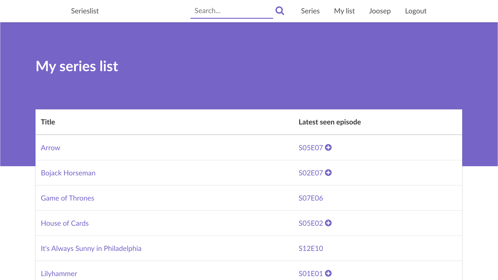
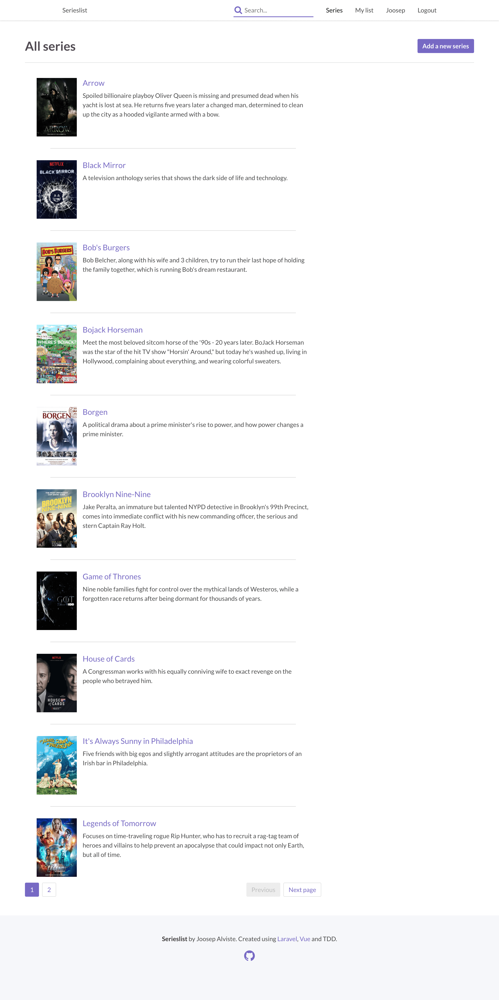
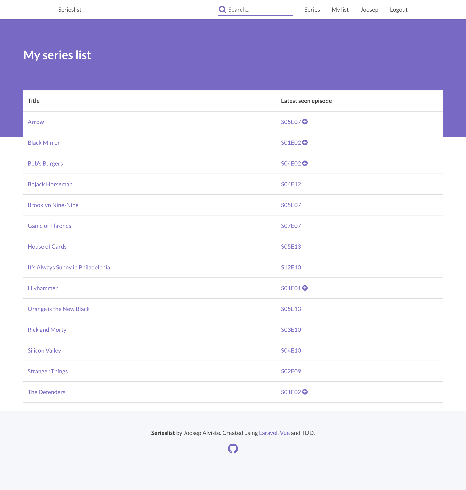
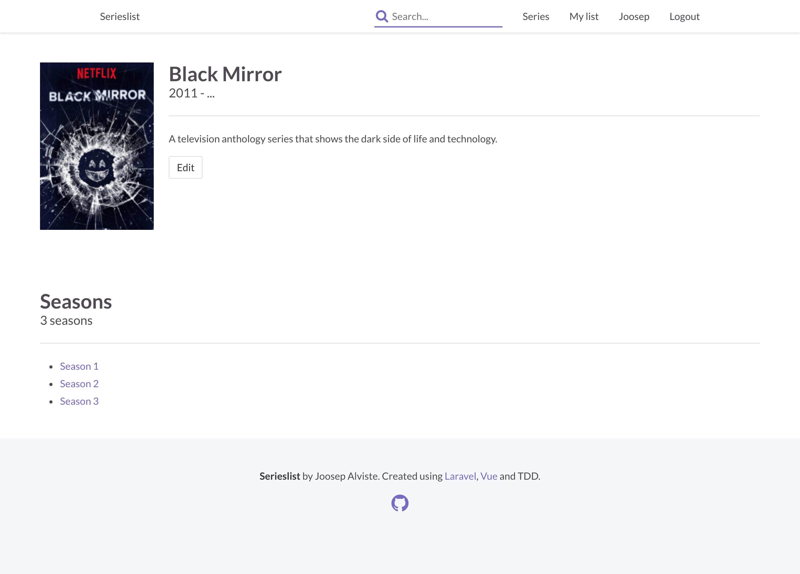
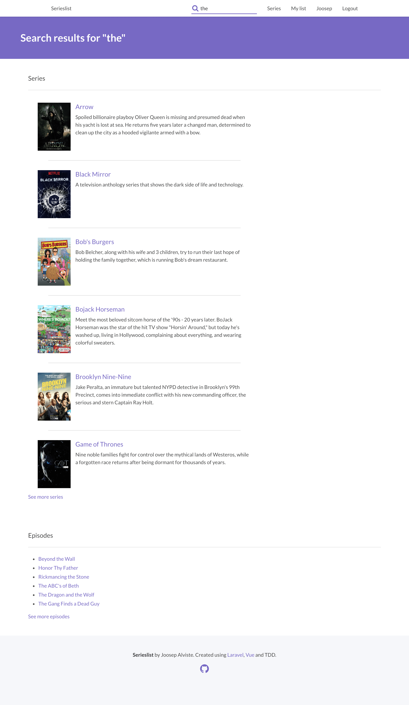
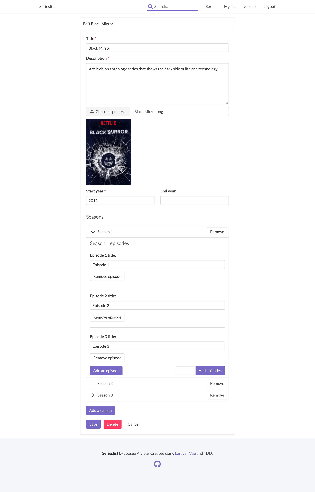

## TL;DR

* Back-end: PHP, Laravel
* Front-end: [Bulma](https://bulma.io), SCSS, JavaScript, Vue.js
* Continuous Integration: [Travis CI](https://travis-ci.org),
  [Codecov](https://codecov.io), DigitalOcean
* Source code: [GitHub](https://github.com/JoosepAlviste/serieslist)
* Live: [https://serieslist.joosep.xyz](https://serieslist.joosep.xyz)

## Background

Used to keep track of your series' progress. Episodes of series can be marked
as seen and the progress of series can be managed in the My List view.

This is just a personal project built because I felt a need to keep track of
my series' progress. So I built this site to do just that. The site is built
using test-driven development.

## Back-end

The main focus of this project is on the back-end. The back-end handles
CRUD operations on series, seasons and episodes, which is a bit complex
since they are all modified in one request. In addition, there are a few
complex queries and cases of information handling in regards to
calculating the latest seen episodes for users and the next episode they
should watch.

All of the written code is covered with unit and feature tests.

## Continuous integration

I use Travis CI to automatically run tests every time I commit something.
The results for the tests are sent to Codecov so that code coverage and
other test related statistics can be viewed there. If these tests pass,
the deployment process is triggered, which uses SSH to log into the
DigitalOcean droplet, executes a Git pull in the project folder and runs
database migrations.

## Screenshots

